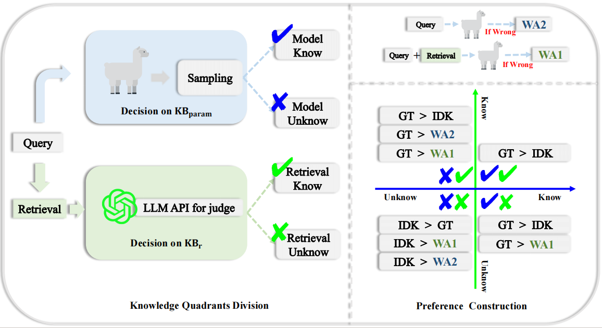

# Divide-Then-Align: Honest Alignment based on the Knowledge Boundary of RAG

<!-- ## Quick links

* [Environment](#Environment)
* [Process](#Process)
* [Training](#Training)
* [Evaluation](#Evaluation)
* [Current Result](#Result) -->



### Environment
Python version is 3.12.4, and we use the following packages:
```bash
pip install -r requirements.txt
```

### Process
Preparation before post-training alignment includes three steps:
1. Download the base models and RAFT models(under `models/`)
2. Divide the knowledge of RAG system to generate dpo training data(under `data_kbrag/model_name`)
3. Divide the knowledge of RAG system to generate evaluation knowledge data(under `data_kbrag/model_name`)

#### Divide the knowledge of RAG system and data construction
We provide the processed data in `data_kbrag`(data will be released later). Under **nq**, **triviaqa**, **webq** folder is the data divided by $\mathrm{KB}_\mathrm{r}$ through GPT-4o api.

To generate the dpo training data, you can run `preprocess.sh`, and set the `eval` to `False`. The training data for RAAT is generated by the following command:
```bash
model_name_or_path="models/llama2"
datasets="nq,triviaqa,webq"
data_path="data_kbrag"
checkpoint_path="models/raat/best_checkpoint.bin"
infer_k=10
eval=False

CUDA_VISIBLE_DEVICES=3 python data_constructer.py \
    --model_name_or_path $model_name_or_path \
    --checkpoint_path $checkpoint_path \
    --datasets $datasets \
    --data_path $data_path \
    --infer_k $infer_k \
    --eval $eval
```

To generate the evaluation knowledge data, you can run `preprocess.sh`, and set the `eval` to `True`. The evaluation data for Llama2-7b is generated by the following command:
```bash
model_name_or_path="models/llama2"
datasets="nq,triviaqa,webq"
data_path="data_kbrag"
infer_k=10
eval=True

CUDA_VISIBLE_DEVICES=3 python data_constructer.py \
    --model_name_or_path $model_name_or_path \
    --datasets $datasets \
    --data_path $data_path \
    --infer_k $infer_k \
    --eval $eval
```

### Training
Run `train.sh` to train the model. The DTA-trained RAAT in the paper uses the following command:
```bash
export NCCL_P2P_LEVEL="NVL"
export OMP_NUM_THREADS=8

model_name_or_path="models/llama2"
checkpoint_path="models/raat/best_checkpoint.bin"
data_dir="data_kbrag/llama2"
data_size=5000
learning_rate=5e-5
per_device_train_batch_size=16
gradient_accumulation_steps=2
idk_ratio=0.7
output_dir="./checkpoints/raat_ir0.7_d5k_0.5mix1.0"
cache_path="data_kbrag/llama2/training_data_ir0.7_d5k.json"
save_steps=10
eval_steps=10
lora_alpha=64
lora_r=64
epochs=3
aux_loss="mix"
coe_cls=0.5
coe_sft=1.0

mkdir -p $output_dir

CUDA_VISIBLE_DEVICES=5 accelerate launch \
    --num_processes 1 \
    --main_process_port 29505 \
    dpo_trainer.py \
    --beta 0.1 \
    --model_name_or_path $model_name_or_path \
    --checkpoint_path $checkpoint_path \
    --learning_rate $learning_rate \
    --per_device_train_batch_size $per_device_train_batch_size \
    --gradient_accumulation_steps $gradient_accumulation_steps \
    --data_dir $data_dir \
    --cache_path $cache_path \
    --data_size $data_size\
    --idk_ratio $idk_ratio \
    --load_in_4bit False\
    --output_dir $output_dir\
    --save_steps $save_steps\
    --eval_steps $eval_steps\
    --num_train_epochs $epochs\
    --lora_alpha $lora_alpha\
    --lora_r $lora_r\
    --aux_loss $aux_loss\
    --coe_cls $coe_cls\
    --coe_sft $coe_sft\
    --report_to none
```

### Evaluation

Evaluate on the knowledge data, containing four knowledge quadrants of data derived from base model. Run `eval.sh` to get result, the predictions and metrics are stored in `result/model_name`.

```bash
model_name_or_path="models/llama2"
benchmark="knowledge"
data_path="data_kbrag"
datasets="nq,triviaqa,webq"
ctxs_num=3
total_size=3000
cache_path="data_kbrag/llama2/evaluation_knowledge.json"
result_path="result"
seed=0

CUDA_VISIBLE_DEVICES=1 python evaluations.py \
    --model_name_or_path $model \
    --benchmark $benchmark \
    --data_path $data_path \
    --datasets $datasets \
    --cache_path $cache_path \
    --ctxs_num $ctxs_num \
    --total_size $total_size \
    --seed $seed \
    --result_path $result_path
```

Baselines are implemented in `baselines/`. You can run `baseline.sh` to reproduce the results of baselines.

