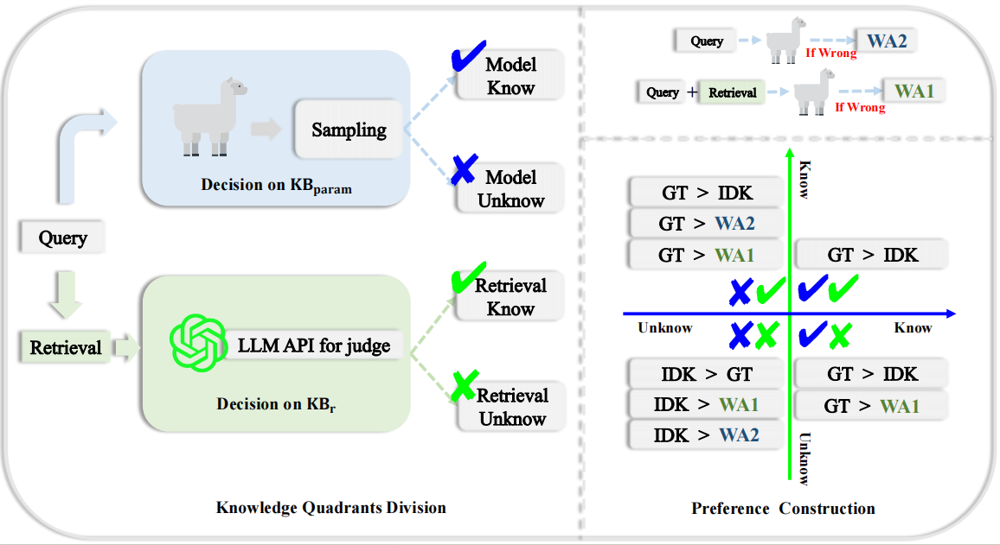

<div align="center">

# Divide-Then-Align: Honest Alignment based on the Knowledge Boundary of RAG


</div>

---

## 📰 News
- **[2025.06]** Dataset divided by $\mathrm{KB}_\mathrm{r}$ is released [here](https://drive.google.com/file/d/1zQzvh3NVRxKz7mECVYl2RW6-v2-oHhso/view?usp=drive_link).

- **🎉 [2025.05]** Our paper has been accepted by **ACL 2025 Main Conference(The 63nd Annual Meeting of the Association for Computational Linguistics)**! [[Paper](https://arxiv.org/abs/2505.20871)]


## 📖 Abstract

This work introduces **Divide-Then-Align (DTA)**, a novel approach for honest alignment in Retrieval-Augmented Generation (RAG) systems. By dividing knowledge into 4 quadrants based on model and retrieval capabilities, we enable more precise alignment that respects the knowledge boundaries of RAG systems.




## 📦 Environment


**Requirements:**
- Python version: `3.12.4`

**Installation:**
```bash
# Clone the repository
git clone https://github.com/JiananXie/Divide-Then-Align.git
cd Divide-Then-Align

# Install dependencies
pip install -r requirements.txt
```


### 🛠️ Knowledge Division and Data Construction

We provide the processed data in `data_kbrag` directory. The **nq**, **triviaqa**, and **webq** folders contain data divided by $\mathrm{KB}_\mathrm{r}$ through GPT-4o API. You can download [here](https://drive.google.com/file/d/1zQzvh3NVRxKz7mECVYl2RW6-v2-oHhso/view?usp=drive_link).

#### Generate DPO Training Data
Run `preprocess.sh` with `eval=False` to generate training data. For RAAT model:

<details>
<summary>📝Generation script </summary>

```bash
model_name_or_path="models/llama2"
datasets="nq,triviaqa,webq"
data_path="data_kbrag"
checkpoint_path="models/raat/best_checkpoint.bin"
infer_k=10
eval=False

CUDA_VISIBLE_DEVICES=3 python data_constructer.py \
    --model_name_or_path $model_name_or_path \
    --checkpoint_path $checkpoint_path \
    --datasets $datasets \
    --data_path $data_path \
    --infer_k $infer_k \
    --eval $eval
```
</details>

#### Generate Evaluation Knowledge Data
Run `preprocess.sh` with `eval=True` to generate evaluation data. For Llama2-7b:

<details>
<summary>📝Generation script</summary>

```bash
model_name_or_path="models/llama2"
datasets="nq,triviaqa,webq"
data_path="data_kbrag"
infer_k=10
eval=True

CUDA_VISIBLE_DEVICES=3 python data_constructer.py \
    --model_name_or_path $model_name_or_path \
    --datasets $datasets \
    --data_path $data_path \
    --infer_k $infer_k \
    --eval $eval
```
</details>

---

## 🚀 Training

Run `train.sh` to train the model with DTA (Divide-Then-Align) methodology. The following command reproduces the DTA-trained RAAT model from our paper:

<details>
<summary>📋 Training Script</summary>

```bash
export NCCL_P2P_LEVEL="NVL"
export OMP_NUM_THREADS=8

model_name_or_path="models/llama2"
checkpoint_path="models/raat/best_checkpoint.bin"
data_dir="data_kbrag/llama2"
data_size=5000
learning_rate=5e-5
per_device_train_batch_size=16
gradient_accumulation_steps=2
idk_ratio=0.7
output_dir="./checkpoints/raat_ir0.7_d5k_0.5mix1.0"
cache_path="data_kbrag/llama2/training_data_ir0.7_d5k.json"
save_steps=10
eval_steps=10
lora_alpha=64
lora_r=64
epochs=3
aux_loss="mix"
coe_cls=0.5
coe_sft=1.0

mkdir -p $output_dir

CUDA_VISIBLE_DEVICES=5 accelerate launch \
    --num_processes 1 \
    --main_process_port 29505 \
    dpo_trainer.py \
    --beta 0.1 \
    --model_name_or_path $model_name_or_path \
    --checkpoint_path $checkpoint_path \
    --learning_rate $learning_rate \
    --per_device_train_batch_size $per_device_train_batch_size \
    --gradient_accumulation_steps $gradient_accumulation_steps \
    --data_dir $data_dir \
    --cache_path $cache_path \
    --data_size $data_size\
    --idk_ratio $idk_ratio \
    --load_in_4bit False\
    --output_dir $output_dir\
    --save_steps $save_steps\
    --eval_steps $eval_steps\
    --num_train_epochs $epochs\
    --lora_alpha $lora_alpha\
    --lora_r $lora_r\
    --aux_loss $aux_loss\
    --coe_cls $coe_cls\
    --coe_sft $coe_sft\
    --report_to none
```
</details>


## 📊 Evaluation

Evaluate models on knowledge data containing four knowledge quadrants derived from the base model. Run `eval.sh` to evaluate the model. Results including predictions and metrics are stored in `result/model_name`.

<details>
<summary>📋 Evaluation Script</summary>

```bash
model_name_or_path="models/llama2"
benchmark="knowledge"
data_path="data_kbrag"
datasets="nq,triviaqa,webq"
ctxs_num=3
total_size=3000
cache_path="data_kbrag/llama2/evaluation_knowledge.json"
result_path="result"
seed=0

CUDA_VISIBLE_DEVICES=1 python evaluations.py \
    --model_name_or_path $model \
    --benchmark $benchmark \
    --data_path $data_path \
    --datasets $datasets \
    --cache_path $cache_path \
    --ctxs_num $ctxs_num \
    --total_size $total_size \
    --seed $seed \
    --result_path $result_path
```
</details>

### 📈 Baseline Comparisons

Baseline implementations are available in `baselines/` directory:
- **ICL Detection**: In-context learning based detection
- **LogProb Detection**: Log probability based detection  
- **P-True Detection**: Probability-based truth detection
- **Self-Consistency Detection**: Self-consistency based detection


## 📚 Citation

If you find our work helpful, please consider citing:

```bibtex
@misc{sun2025dividethenalignhonestalignmentbased,
      title={Divide-Then-Align: Honest Alignment based on the Knowledge Boundary of RAG}, 
      author={Xin Sun and Jianan Xie and Zhongqi Chen and Qiang Liu and Shu Wu and Yuehe Chen and Bowen Song and Weiqiang Wang and Zilei Wang and Liang Wang},
      year={2025},
      eprint={2505.20871},
      archivePrefix={arXiv},
      primaryClass={cs.CL},
      url={https://arxiv.org/abs/2505.20871}, 
}
```
---

<div align="center">

**🌟 If you find this work useful, please give us a star! 🌟**


</div>

